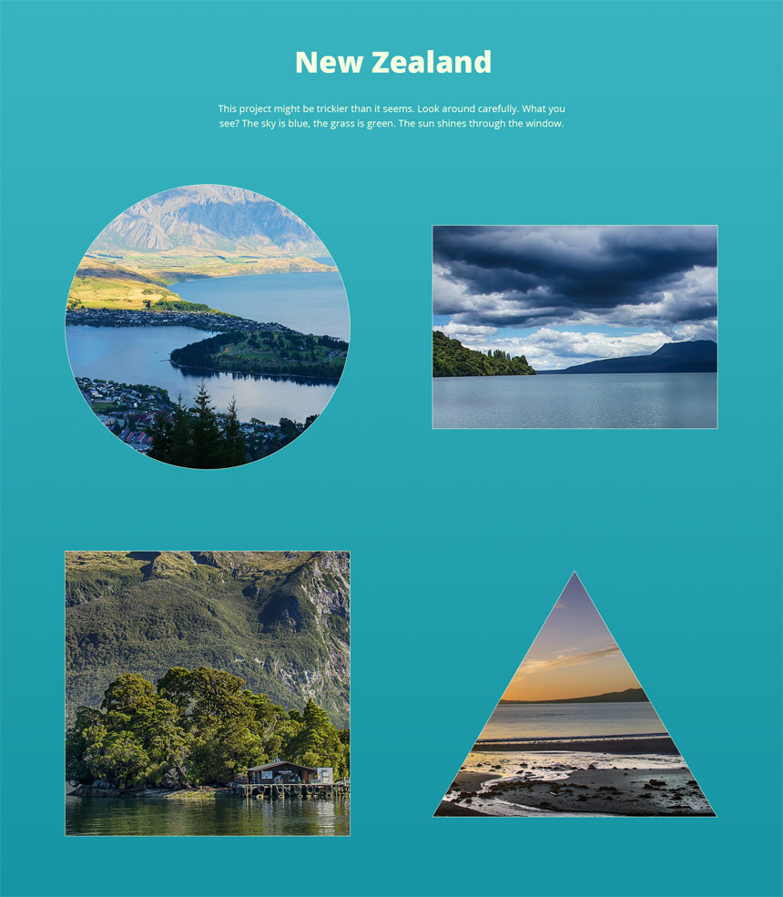

Front-end Test Project
======================

## Project brief
Convert the following designs to HTML/CSS/JS.

- When you have completed the exercise, zip up your solution and send it back via email
- Please DO NOT fork this project on Github

### Thumbnails

### Overlay

## Requirements
1. Use HTML5 / CSS
2. Make it mobile & tablet responsive using your best judgement
3. Create an interesting hover effect for the image thumbnails
4. Create a simple custom overlay which displays the full size image on clicking on a image thumbnail - use only vanilla JavaScript, no jQuery or any other external library for it
5. Make the page the smallest possible size - ensure that images, JS and CSS are properly optimized, compressed, minified etc for quick page loads (please also include the non-minified versions in your zip)
6. *Optional bonus task 1:* Use [responsive images](https://jakearchibald.com/2015/anatomy-of-responsive-images/)

## Design
- See front-end-test-wireframe.psd
- The font used in the design is Open Sans
- The following images are used in the design:
  -  https://pixabay.com/en/new-zealand-lake-mountain-landscape-679068/
  -  https://pixabay.com/en/new-zealand-lake-web-kai-dock-583176/
  -  https://pixabay.com/en/new-zealand-doubtful-sound-fjord-583181/
  -  https://pixabay.com/en/sun-rise-beach-new-zealand-auckland-661541/

## Supported browsers
Ensure that the elements work and display correctly in the following browsers:

- Firefox (latest version)
- Google Chrome (latest version)
- Microsoft Edge
- Internet Explorer 11

## Coding Standards
When working on the project use consistent coding style. You can also check guidelines like [Code Guide](http://codeguide.co/) or [CSS Guidelines](http://cssguidelin.es/).

## Quality Assurance

What you need to do to get high QA score?

### General

- Are all requirements set above met?
- Is the page working without any JS errors?

### Precision

- Is reasonable precision achieved?

### Browser check

- Does page display and work correctly in supported browsers?

### Valid HTML

- Is the page valid?

### Semantic Markup

- Are the correct tags being used?

### Coding Standards

- Is the page using a consistent HTML coding style?
- Is the page using a consistent CSS coding style?
- Is the page using a consistent JS coding style?

### Optimization

- Are image files sufficiently compressed?
- Is the CSS and JS minified?

### Accessibility

- Are proper ALT attributes for images provided?
- Are ARIA attributes properly used?
- Is proper heading structure in place?
